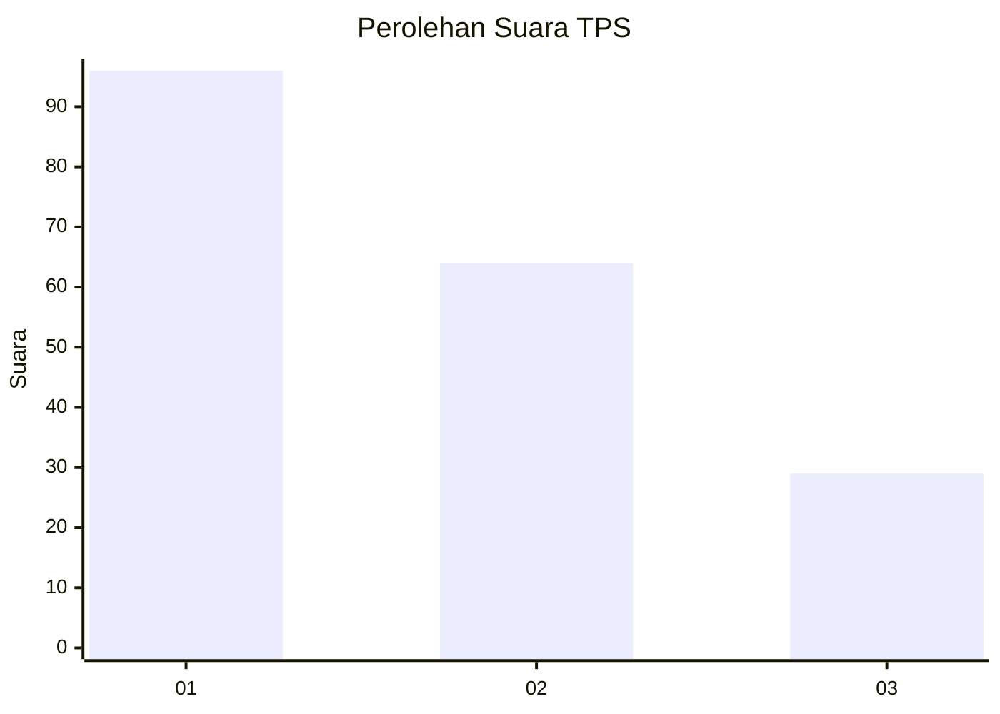
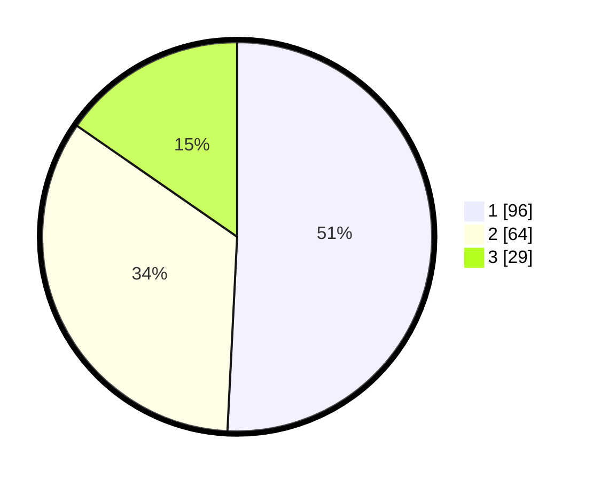

# Hasil

## Grafik

## Tabel

| No. | Nama Paslon    | Suara | Suara (raw) | Persentase |
|:--- |:-------------- | -----:| -----------:| ----------:|
| 1   | ANIES MUHAIMIN | 96    | [96][p-1]   | 50,79      |
| 2   | PRABOWO GIBRAN | 64    | [64][p-2]   | 33,86      |
| 3   | GANJAR MAHFUD  | 29    | [29][p-3]   | 15,34      |

[p-1]: https://github.com/gigit-pemilu/pemilu-2024-34-di-yogyakarta/blob/main/pilpres/hitung-suara/sub/34-di-yogyakarta/sub/71-kota-yogyakarta/sub/14-kotagede/sub/1003-purbayan/sub/024-tps/sub/paslon-1.txt
[p-2]: https://github.com/gigit-pemilu/pemilu-2024-34-di-yogyakarta/blob/main/pilpres/hitung-suara/sub/34-di-yogyakarta/sub/71-kota-yogyakarta/sub/14-kotagede/sub/1003-purbayan/sub/024-tps/sub/paslon-2.txt
[p-3]: https://github.com/gigit-pemilu/pemilu-2024-34-di-yogyakarta/blob/main/pilpres/hitung-suara/sub/34-di-yogyakarta/sub/71-kota-yogyakarta/sub/14-kotagede/sub/1003-purbayan/sub/024-tps/sub/paslon-3.txt

## Foto C Plano

https://sirekap-obj-formc.kpu.go.id/75cc/pemilu/ppwp/34/71/14/10/03/3471141003024-20240214-155111--06f9b9c8-18b6-4924-9511-d2abc0eae6e7.jpg

https://sirekap-obj-formc.kpu.go.id/75cc/pemilu/ppwp/34/71/14/10/03/3471141003024-20240214-155235--1104f0d8-247b-4237-98b2-8c4a370ec05a.jpg

https://sirekap-obj-formc.kpu.go.id/75cc/pemilu/ppwp/34/71/14/10/03/3471141003024-20240214-155255--e92540a4-0617-4a39-832f-9abf3120fa72.jpg

## Metadata

| Key        | Value               |
| ---------- | ------------------- |
| Time Stamp | 2024-02-24 22:31:28 |

