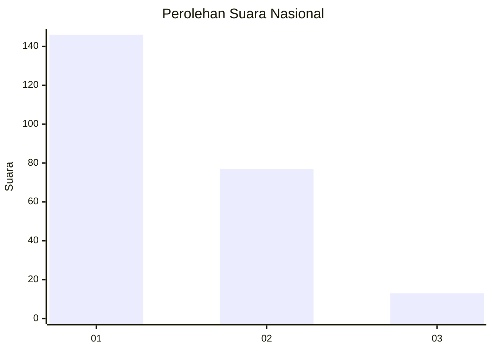
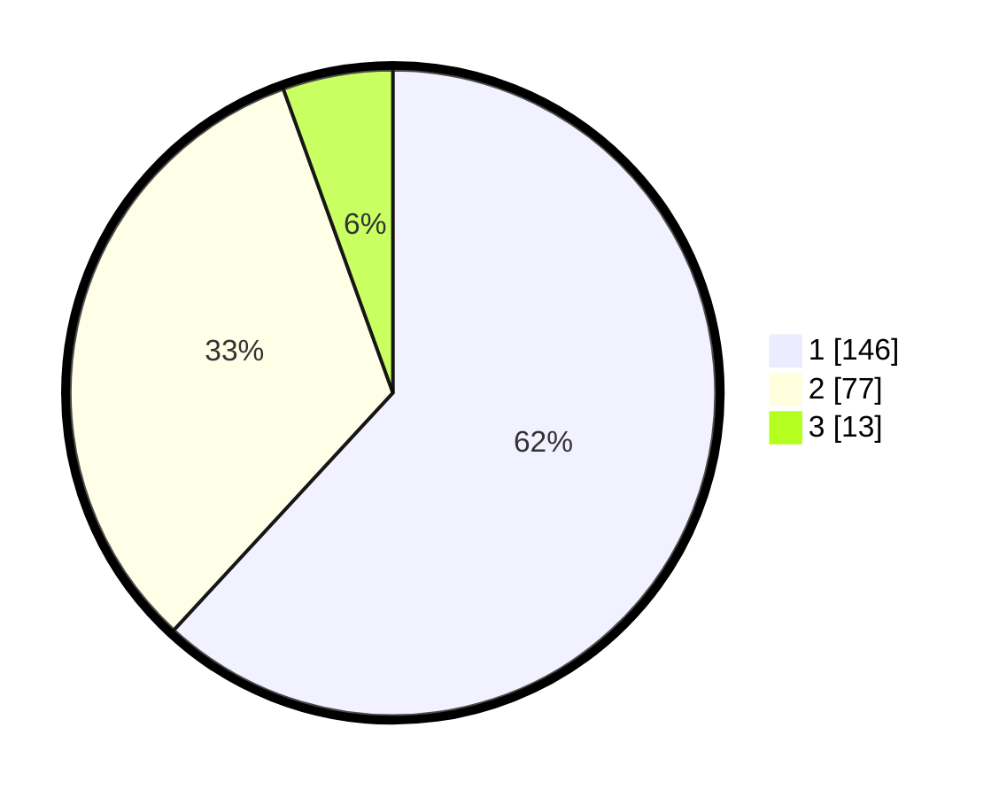

# Hasil

## Grafik

## Tabel

| No. | Nama Paslon    | Suara | Suara (raw) | Persentase |
|:--- |:-------------- | -----:| -----------:| ----------:|
| 1   | ANIES MUHAIMIN | 146   | [146][p-1]  | 61,86      |
| 2   | PRABOWO GIBRAN | 77    | [77][p-2]   | 32,63      |
| 3   | GANJAR MAHFUD  | 13    | [13][p-3]   | 5,51       |

[p-1]: https://github.com/gigit-pemilu/pemilu-2024/blob/main/pilpres/hitung-suara/sub/34-di-yogyakarta/sub/71-kota-yogyakarta/sub/14-kotagede/sub/1003-purbayan/sub/029-tps/sub/paslon-1.txt
[p-2]: https://github.com/gigit-pemilu/pemilu-2024/blob/main/pilpres/hitung-suara/sub/34-di-yogyakarta/sub/71-kota-yogyakarta/sub/14-kotagede/sub/1003-purbayan/sub/029-tps/sub/paslon-2.txt
[p-3]: https://github.com/gigit-pemilu/pemilu-2024/blob/main/pilpres/hitung-suara/sub/34-di-yogyakarta/sub/71-kota-yogyakarta/sub/14-kotagede/sub/1003-purbayan/sub/029-tps/sub/paslon-3.txt

## Foto C Plano

https://sirekap-obj-formc.kpu.go.id/58e5/pemilu/ppwp/34/71/14/10/03/3471141003029-20240214-195630--3c17cb67-17d2-4b99-bceb-6aced468f813.jpg

https://sirekap-obj-formc.kpu.go.id/58e5/pemilu/ppwp/34/71/14/10/03/3471141003029-20240214-195641--68802c81-836d-4d2b-b222-1c1d17c123ad.jpg

https://sirekap-obj-formc.kpu.go.id/58e5/pemilu/ppwp/34/71/14/10/03/3471141003029-20240214-195649--8680c145-53ad-4ccf-9250-b73731f08fcb.jpg

## Metadata

| Key        | Value               |
| ---------- | ------------------- |
| Time Stamp | 2024-02-25 18:00:00 |

